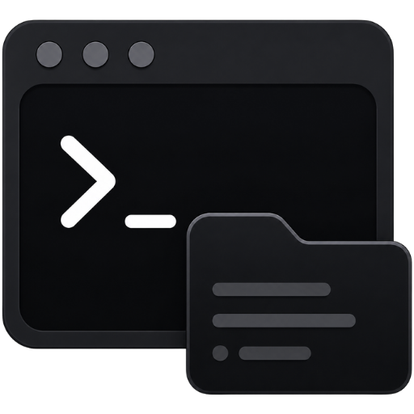
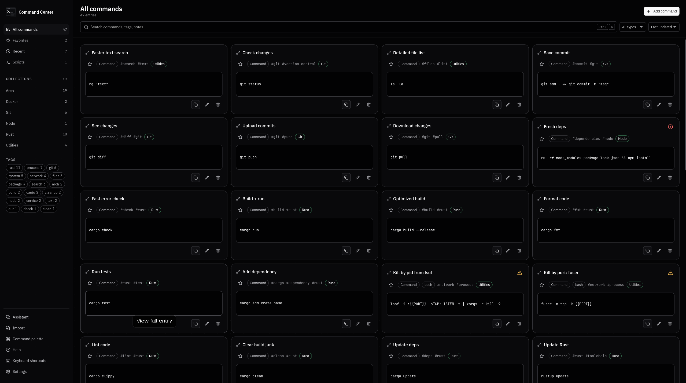
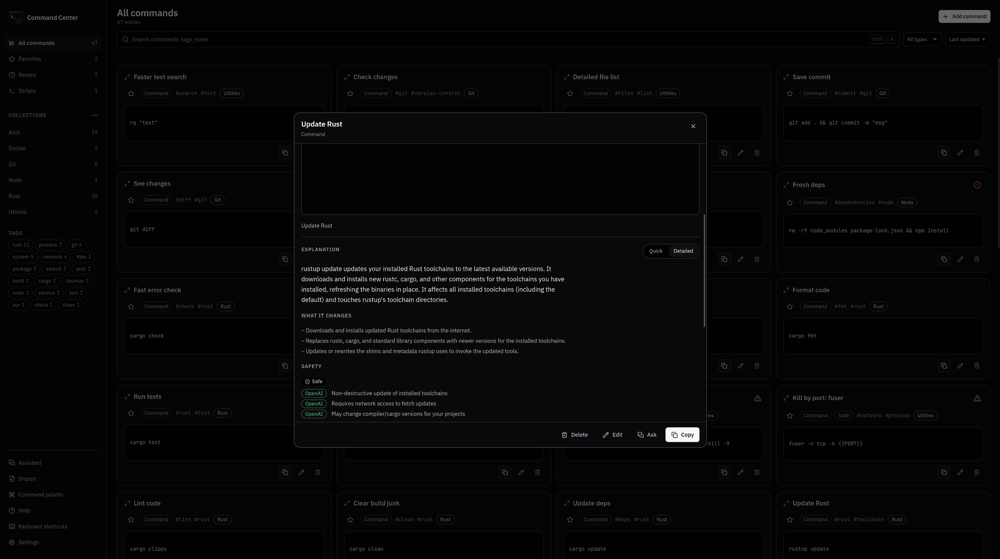
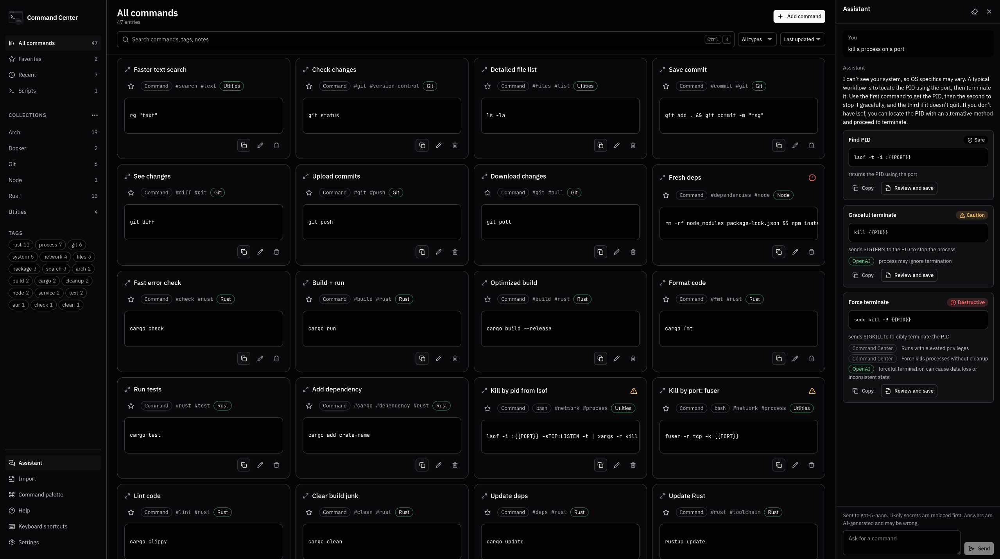

<p align="center">
  
</p>

<h1 align="center">Command Center</h1>

<p align="center">
  A local-first desktop library for terminal commands, scripts, snippets, and the
  notes you never want to hunt down twice.
</p>

<p align="center">
  <a href="https://github.com/pinkpixel-dev/command-center/releases">Downloads</a>
  ·
</p>

## Download and install

The easiest way to install Command Center is from the
[GitHub Releases page](https://github.com/pinkpixel-dev/command-center/releases).
Open the version you want, expand **Assets**, and download the installer for
your system.

| Platform | What to download | Install |
| --- | --- | --- |
| Windows | The `.msi` or setup `.exe` | Open the downloaded installer and follow the prompts. |
| Linux | The `.AppImage`, `.deb`, or `.rpm` provided with the release | Use the package for your distribution. For an AppImage, make it executable and open it. |

Windows installers produced by the project workflow are currently unsigned.
Windows SmartScreen may show an unknown-publisher warning, so check that the
download came from the official Pink Pixel repository before continuing.

An AppImage can be started from a terminal with:

```bash
chmod +x ./*.AppImage
./"Command Center_"*.AppImage
```

Release assets are attached manually. If a platform build is not listed for a
version, build it from source using the instructions below.

## What Command Center does

Command Center keeps commands, scripts, sequences, code snippets, configuration
fragments, and reference notes in one searchable local library. The actual data
lives in SQLite on your machine. There is no Command Center account and no
hosted sync service.

- Search titles, content, descriptions, notes, tags, collections, and saved AI
  explanations with SQLite FTS5.
- Organize entries with collections, tags, favorites, and recent-copy history.
- Browse complete collection and tag directories without letting either list
  take over the sidebar.
- Select the visible entries to add them to a collection or delete them
  together. Adding a collection keeps their existing memberships intact.
- Use responsive cards or a denser compact list.
- Fill `{{named}}` placeholders when copying a saved command without storing the
  temporary values.
- See local Safe, Caution, or Destructive labels with the reasons behind them.
- Export the complete library or one collection to readable Markdown, or create
  a restorable SQLite backup.
- Use dark, high-contrast dark, light, or system-matched themes.
- Work with a mouse, touch, or keyboard. The app is usable down to phone-sized
  layouts even though it runs as a desktop application.

Command Center copies commands. It does not execute them.

## Screenshots

<p align="center">
  
</p>

<p align="center">
  
</p>

<p align="center">
  
</p>

## Optional AI features

AI support is optional and off by default. The complete command library,
search, organization, templates, local risk checks, export, and backup features
work without an API key or network connection.

The 1.0.0 pre-release pass exercised connection, import, explanation,
assistant, terminal-error analysis, and shell-conversion quality against a real
OpenAI account. Automated tests still use local fixtures and do not require a
developer key or make live model calls.

When you choose to enable it, Command Center can:

- pull useful entries out of an inconsistent cheat sheet or README, then send
  them through the normal local review flow;
- explain a saved entry with a quick summary and a detailed breakdown;
- answer command questions in a temporary assistant conversation;
- read pasted terminal output and show how strongly the paste supports its
  likely diagnosis;
- rewrite a saved entry for bash, fish, zsh, or PowerShell while calling out
  behavior that changed or did not carry over.

Model output never bypasses the local risk rules. AI suggestions are not run or
saved automatically, and a shell conversion is never presented as guaranteed
equivalent.

### Setup

1. Open **Settings**.
2. Turn on **AI features**.
3. Choose a model. `gpt-5.6-luna` is the default, but the model list and a
   custom model ID are both available.
4. Add your OpenAI API key.
5. Use **Test connection** before starting an AI action.

Rust sends the key directly from the operating system credential manager. It is
not written to the library database, browser storage, application logs, or
returned to the React frontend. You can replace or remove it from Settings.
There is no plaintext fallback when secure credential storage is unavailable.

### What leaves the machine

Every model request uses OpenAI's Responses API with `store: false`. Command
Center does not send the whole library. It sends only the content needed for the
action you started:

| Action | Content sent |
| --- | --- |
| Test connection | Fixed application test text and a small structured-output schema. |
| AI-assisted Import | The document you selected after local likely-secret redaction, plus the extraction instructions. |
| Explain | The saved entry you opened after local likely-secret redaction. |
| Assistant | Your question, bounded in-memory conversation history, and the one saved entry you opened it from when applicable. |
| Read a terminal error | The pasted output after disclosure and local likely-secret redaction. Follow-ups carry the numbered, redacted paste and bounded conversation history. |
| Convert to another shell | The saved entry you opened, its known source shell, and the target shell you selected, after local likely-secret redaction. |

Import and terminal-error pastes stop at a disclosure screen first. It shows
the outbound size, selected model, and every value the local detector replaced,
including its line number and placeholder. You still choose whether to send it.

The detector looks for likely credentials, tokens, private keys, authorization
headers, and credentials embedded in URLs. It reduces accidental exposure, but
it cannot guarantee that every possible secret will be recognized. Check the
disclosure before sending.

### What stays local

- Imported candidates are only written to SQLite after you review and import
  them.
- Explanations are cached in SQLite so reopening one does not make another
  request. Edit the entry and the cached explanation is marked stale. **Clear
  saved explanations** in Settings removes the cache.
- Assistant and terminal-error conversations stay in memory for the current
  application window and are not written to the database.
- Converted commands are not stored unless you choose **Review and save**,
  which creates a new entry instead of overwriting the original.

## Keyboard shortcuts

| Shortcut | Action |
| --- | --- |
| `Ctrl/Cmd + K` | Open the command palette |
| `Ctrl/Cmd + Shift + K` | Open the AI assistant when AI is available |
| `/` | Focus library search |
| `N` | Add an entry |
| `↑` / `↓` | Move through the current list |
| `Enter` | Open the focused entry |
| `?` | Show the shortcut reference |
| `Esc` | Close the active surface or clear search |

The command palette also provides searchable access to library views, Import,
the assistant, terminal-error analysis, Help, Settings, export, and backup.
AI actions only appear when AI is enabled and a key is stored.

## Where your data is

The library is one SQLite file in the platform application-data directory:

- Linux: `~/.local/share/dev.pinkpixel.commandcenter/library.db`
- macOS: `~/Library/Application Support/dev.pinkpixel.commandcenter/library.db`
- Windows: `%APPDATA%\dev.pinkpixel.commandcenter\library.db`

The exact path is shown under **Settings → About**. Use the built-in database
backup action instead of copying a library while the app is writing to it. The
backup checkpoints pending SQLite WAL data first.

## Build from source

Source builds are mainly for development and contributing. You need:

- [Node.js](https://nodejs.org/) 20.19 or newer, or 22.12 or newer;
- [Rust](https://rustup.rs/) with the stable toolchain;
- the [Tauri 2 prerequisites](https://v2.tauri.app/start/prerequisites/) for
  your operating system.

Clone the repository and install the locked frontend dependencies:

```bash
git clone https://github.com/pinkpixel-dev/command-center.git
cd command-center
npm ci
```

Start the Tauri development application:

```bash
npm run tauri dev
```

Run the complete automated check:

```bash
npm run check
```

Build native installers for the current operating system:

```bash
npm run tauri build
```

Useful individual checks:

```bash
npm run typecheck
npm run test
npm run test:rust
```

## Contributing

Keep changes focused, add useful tests, and run `npm run check` before opening a
pull request. Use a feature or fix branch rather than committing directly to
`main`.

The main pieces are:

```text
src/                  React frontend
  components/         Application and UI components
  hooks/              Library, settings, AI, and keyboard state
  lib/                Types, IPC wrappers, and pure helpers
  styles/             Shared tokens and responsive styles
src-tauri/
  src/ai/             OpenAI client, prompts, redaction, and proposal review
  src/db/             SQLite schema, queries, FTS5, and explanation cache
  src/import/         Document parsing, classification, and import execution
  src/ipc/            Tauri commands exposed to the frontend
  tests/              Integration tests against real temporary databases
```

## License and support

Command Center is licensed under the [Apache License 2.0](LICENSE).

- Website: [pinkpixel.dev](https://pinkpixel.dev)
- Issues: [github.com/pinkpixel-dev/command-center/issues](https://github.com/pinkpixel-dev/command-center/issues)
- Support: [support@pinkpixel.dev](mailto:support@pinkpixel.dev)

Made with 💖 by [Pink Pixel](https://pinkpixel.dev)
